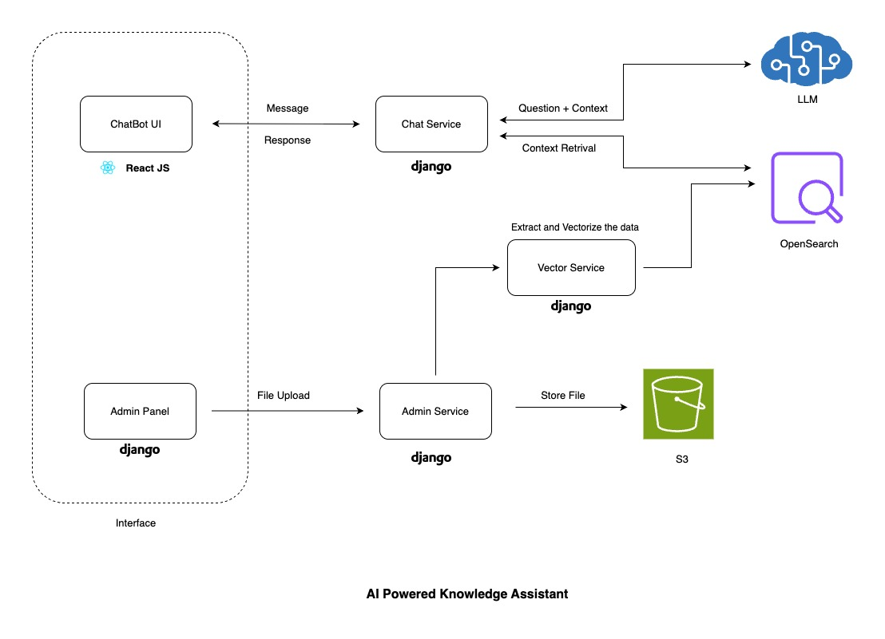

# AI Powered Knowledge Assistant

An AI-driven knowledge assistant combines a lightweight, embeddable chatbot with a secure admin panel. Admins can upload PDF or text documents via the dashboard, which are automatically chunked, vectorized using state-of-the-art embeddings, and indexed into OpenSearch. The chatbot—powered by a locally hosted Qwen 3 model via `llama.cpp`—leverages this knowledge to provide real-time, context-aware responses with clear source attribution. Designed for seamless integration into partner websites through an iframe.


---

## 🧠 Features

- 🤖 **AI Chatbot** powered by **Qwen 3** (via `llama.cpp`)
- 📁 **Admin Panel** to upload PDFs or text files
- 🔍 **Semantic Embedding** using `nomic-embed-text-v1`
- 📦 Indexed in **OpenSearch** with FAISS KNN search
- 📚 **Source-aware answers** with document highlighting
- 🧠 **Contextual chat history** with memory support
- 🧾 **Markdown rendering** in chat
- 💬 **Embeddable Chat Widget** – easily insert into any site via `<iframe>`
- 🔐 Basic **auth flow** and CSRF-protected admin interface

---

## 🧱 Architecture



---

- 📍 **Chatbot UI available at**: `http://localhost:5173/`  
- 🛠️ **Admin Panel runs on**: `http://localhost:8000/`

---
## ⚙️ Tech Stack

| Layer      | Technology                                       |
|------------|--------------------------------------------------|
| Frontend   | React JS + Tailwind CSS                             |
| Backend    | Django + Django REST Framework                   |
| AI Model   | [Qwen3-0.6B] with `llama.cpp` |
| Embedding  | `nomic-embed-text-v1` via `sentence-transformers` |
| Vector DB  | OpenSearch with FAISS indexing                   |
| Storage    | AWS S3 (for PDF/text upload and model download)  |
| Auth       | Django authentication with optional login intent |
| Infra      | Docker + AWS EC2 (local LLM inference)           |
| Language   | Python 3.9.22, Node.js 22.16.0                    |

---


## 🚀 Getting Started

### Prerequisites

- Python 3.9.22
- Node.js 22.16.0
- OpenSearch running (locally or managed)
- AWS credentials configured for S3 access

### 1. Backend Setup

```bash
pip install -r requirements.txt

# Set environment variables (use .env or export)
export AWS_ACCESS_KEY_ID=...
export AWS_SECRET_ACCESS_KEY=...

# Run Django server
python manage.py makemigrations
python manage.py migrate
python manage.py runserver
```

### 2. Frontend Setup

```bash
cd UI/
npm ci
npm run dev 
```

---

## 🧪 API Endpoints

### `/message` [POST]
Chat endpoint that supports:
- Standard queries
- `\clear` to reset history
- `\delete` to purge vector index

```json
POST /message
{
  "message": "How does our API work?"
}
```

### `/download/<filename>` [GET]
Downloads the source file from S3.


---

## 🧠 LLM Integration (Qwen + llama.cpp)

- Download `Qwen3-0.6B-Q8_0.gguf` from (https://www.kaggle.com/models/qwen-lm/qwen-3/gguf/0.6b)
- Loads with `llama_cpp.Llama` using mmap, mlock, and GPU acceleration
- Uses `<|im_start|>` and `<|im_end|>` format for ChatML compatibility
- Supports chat summarization for long conversations

---

## 🧩 Embedding in Websites

Embed the chat in any HTML page:

```html
const iframe = document.createElement('iframe');
iframe.src = 'http://localhost:5173/chat.html';
iframe.style.background = 'transparent';
iframe.style.border = 'none';
iframe.style.width = '400px';
iframe.style.height = '600px';
iframe.style.position = 'fixed';
iframe.style.bottom = '20px';
iframe.style.right = '20px';
iframe.style.zIndex = '9999';
iframe.allow = 'clipboard-write';
iframe.setAttribute('allowtransparency', 'true');
document.body.appendChild(iframe);
```

---